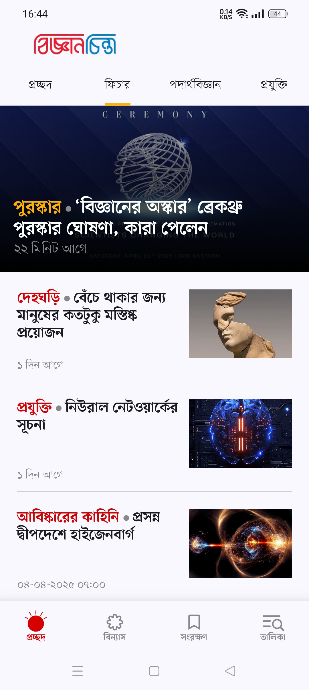
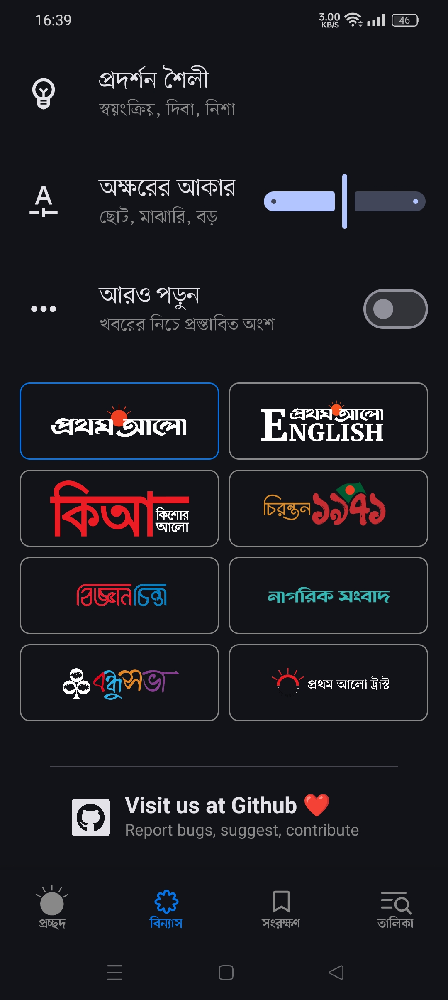
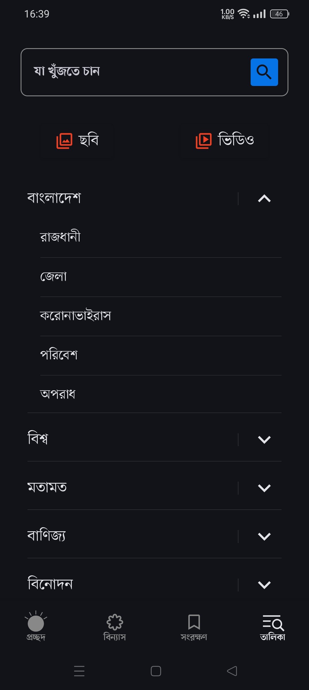

# ProthomAlo

  

## • Overview

This is an unofficial android client of a bangladeshi news meida: ProthomAlo. It serves articles in real-time with a modern looking UI and features that put UX first. Made in Android Studio using Jetpack Compose.
## • Features

- ProthomAlo, KishorAlo + 6 related websites.
- Swipe to switch between articles. 
- Bookmark articles for offline read.
- Share articles as pdf.
- In-built Prothomalo url explorer.
- Dark theme support.
- 0 ads + 0 trackers = ∞ bandwidth saved!

## • Installation

<!--  -->

## • Screenshots

|  |  |
|-------------------------------------|---------------------------------------------|
|  |    |

## • Current feature plans

- ~~Homepage rearrange option.~~ ✅
- Date selector for search.
- Sorting for Bookmark / Search page 
- Article pinning for bookmarks.

> [!Note]
>  I'm looking forward to turn it to a general article reader app with extensions.

